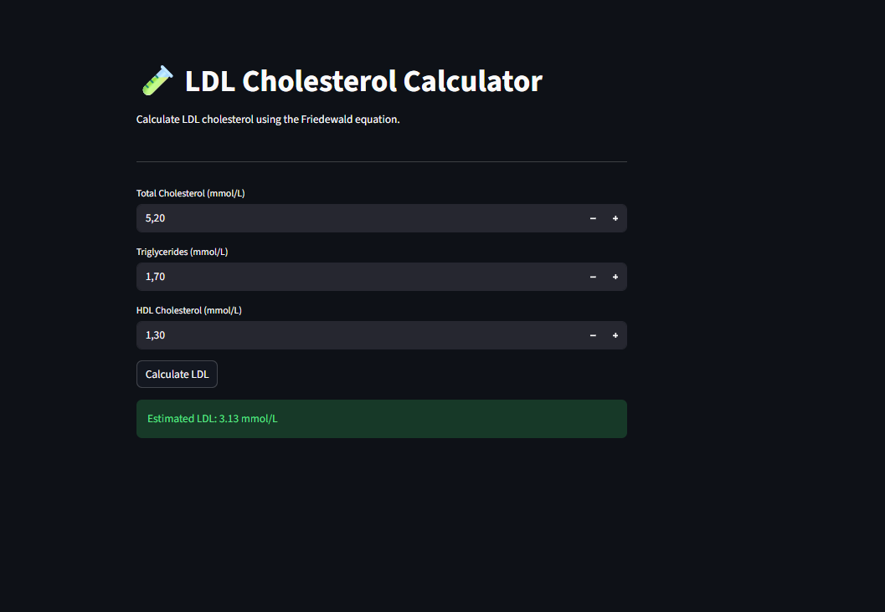

# 🧪 LDL Cholesterol Calculator

A simple biomedical web application developed with **Python** and **Streamlit** to estimate LDL cholesterol using the **Friedewald equation**.

## 📌 About the Project

This application calculates estimated LDL cholesterol from three laboratory parameters:

* Total Cholesterol
* Triglycerides
* HDL Cholesterol

The calculator uses **mmol/L** as the unit.

## 🧮 Formula

For values expressed in mmol/L:

**LDL = Total Cholesterol − HDL − (Triglycerides / 2.2)**

### Example

Given:

* Total Cholesterol = 5.2 mmol/L
* Triglycerides = 1.7 mmol/L
* HDL Cholesterol = 1.3 mmol/L

The estimated LDL is:

**3.13 mmol/L**

## 📸 Application Preview



## 🚀 Features

* LDL cholesterol calculation
* mmol/L units
* Input validation
* Simple and intuitive interface
* Biomedical-oriented application
* Built with Python and Streamlit

## 🛠️ Technologies

* Python 3.11
* Streamlit

## 📂 Project Structure

```text
ldl-cholesterol-calculator/
│
├── app.py
├── requirements.txt
└── README.md
```

## ⚙️ Installation

Clone the repository:

```bash
git clone https://github.com/TakoiRizgui/ldl-cholesterol-calculator.git
```

Navigate to the project directory:

```bash
cd ldl-cholesterol-calculator
```

Install the dependencies:

```bash
pip install -r requirements.txt
```

Run the application:

```bash
streamlit run app.py
```

## ⚠️ Medical Disclaimer

This application is intended for **educational and demonstration purposes only**.

The estimated LDL value should not be considered a medical diagnosis or a substitute for professional medical advice.

## 👩‍💻 Author

**Takwa Rizgui**

Master's student in Big Data & Data Science
Background in Biomedical Biology

Interested in:

* Data Science
* Artificial Intelligence
* Biomedical Data
* Healthcare AI
* Medical Diagnostics
